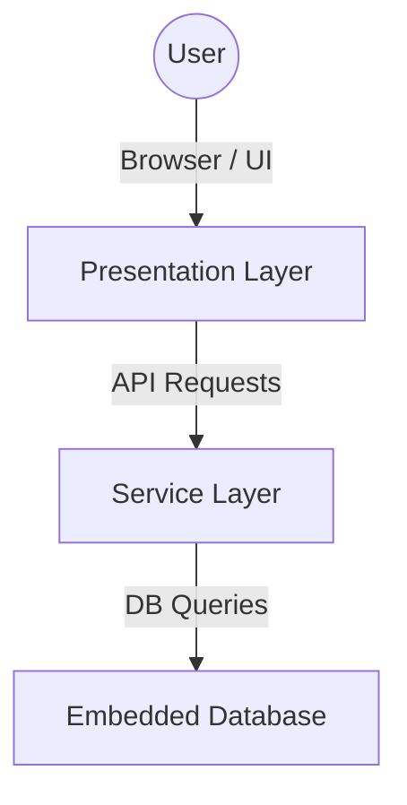

# Get Started

To get a quick preview of everything, simply run : 

`docker compose up -d --build`

# Architecture Diagram

This diagram represents a 3-tier architecture, commonly used in modern applications:

1. **Presentation Layer**
   - Responsible for everything related to the user interface (UI).
   - Delivers a user-friendly experience for displaying information and capturing user input.
   - Forwards user actions as requests to the service layer.

2. **Service Layer**
   - Also referred to as the business logic or middle layer.
   - Processes input from the presentation layer, enforces application logic, and coordinates data operations.
   - Serves as the bridge between the presentation layer and the data layer.

3. **Data Layer (Embedded Database)**
   - Stores and manages the application’s data.
   - Executes queries (e.g., create, read, update, delete).
   - Provides persistent storage to ensure data is available across sessions.

**Benefits of this structure include:**
- **Scalability and maintainability.** Each layer can be scaled or updated independently.
- **Clear separation of concerns.** Presentation, business logic, and data operations are each organized in their own layer.